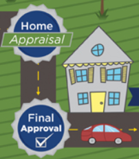


---

## SECTION 1 : PROJECT TITLE
## Mortgage Process System

---
## SECTION 2 : EXECUTIVE SUMMARY / PAPER ABSTRACT
Mortgage process system utilizes the machine reasoning technics to help the bank to approve the home mortgage application. 

---
## SECTION 3 : CREDITS / PROJECT CONTRIBUTION

| Official Full Name  | Student ID (MTech Applicable)  | Work Items (Who Did What) | Email (Optional) |
| :------------ |:---------------:| :-----| :-----|
| Cao Liang | A0012884E | Implementation, documentation |A0012884E@nus.edu.sg |

---
## SECTION 4 : VIDEO OF SYSTEM MODELLING & USE CASE DEMO

---
## SECTION 5 : USER GUIDE

`<Github File Link>` : <https://github.com/caoliang/IRS-MR-2019-01-19-IS1FT-IND-CaoLiang-Mortgage_Process_ISS_MR/blob/master/UserGuide/User%20Guide%20Mortgage%20Process%20System.pdf>

### [ 1 ] To run the system using iss-vm

> download pre-built virtual machine from http://bit.ly/iss-vm

> start iss-vm

> open terminal in iss-vm

> $ git clone https://github.com/caoliang/IRS-MR-2019-01-19-IS1FT-IND-CaoLiang-Mortgage_Process_ISS_MR.git

> $ /home/iss-user/iss-vm-program/is-intelligent-reasoning-systems/jboss/jbpm-server-7.12.0.Final-dist/bin/standalone.sh

> **Go to URL using web browser** http://localhost:8080/jbpm-console/

---
## SECTION 6 : PROJECT REPORT / PAPER

`<Github File Link>` : <https://github.com/caoliang/IRS-MR-2019-01-19-IS1FT-IND-CaoLiang-Mortgage_Process_ISS_MR/blob/master/ProjectReport/Project%20Report%20Mortgage%20Process%20System.pdf>

**Recommended Sections for Project Report / Paper:**
- Executive Summary / Paper Abstract
- Sponsor Company Introduction (if applicable)
- Business Problem Background
- Project Objectives & Success Measurements
- Project Solution (To detail domain modelling & system design.)
- Project Implementation (To detail system development & testing approach.)
- Project Performance & Validation (To prove project objectives are met.)
- Project Conclusions: Findings & Recommendation
- List of Abbreviations (if applicable)
- References (if applicable)

---
## SECTION 7 : MISCELLANEOUS

---

